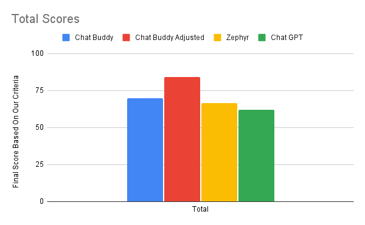

# Chat Buddy!


(Image made by Stable Diffusion XL)

[Try The Model!](https://huggingface.co/spaces/Norok-The-Diablo/ChatBuddy)

A chatbot I made for my 8th-grade science fair

This chatbot is geared towards explaining thought process while helping with educational questions, kind of like an open source Khanmigo

For the model, run the command: ```wget https://huggingface.co/TheBloke/zephyr-7B-beta-GGUF/resolve/main/zephyr-7b-beta.Q8_0.gguf``` If you have 16 GB of VRAM or normal RAM

If you only have 8 GB of RAM/VRAM run this command: ```wget https://huggingface.co/TheBloke/zephyr-7B-beta-GGUF/resolve/main/zephyr-7b-beta.Q4_K_M.gguf```, and then change the model to ```zephyr-7b-beta.Q4_K_M.gguf```

The model is [@TheBloke's](https://huggingface.co/TheBloke) quantizations of Zephyr 7B, which is currently the best-performing small model.

This is a data table after running some tests with this criteria:

Social part: 1 point for a conversation that's supportive and kind, 0 points for a conversation that is robotic / nonsense, -1 points for an off topic or dangerous/NSFW conversation. 
Math and Science part: 1 point for explaining the problem with the chain of thought and getting it right, 0 points for just giving the answer, 0.5 points for getting the answer wrong but explaining chain of thought, -1 points for wrong and not explaining chain of thought. 
Literature part: 1 point for good analysis or explanation, 0.5 points for attempting to analyze but missing key points or not fully explaining thoughts, 0 points for giving a simple summary or not engaging with the deeper aspects of the text, -1 points for completely incorrect interpretations or unrelated responses.

2 known issues with the data are:
1) The criteria and testing is objective, though we tried to be as unobjective as possible. 
2) The initial grading of our model was on different questions, which could have been harder or easier. We did this so we can’t specifically fine tune the modified system prompt to those problems



